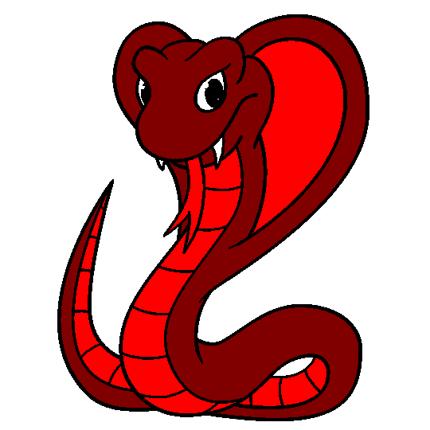
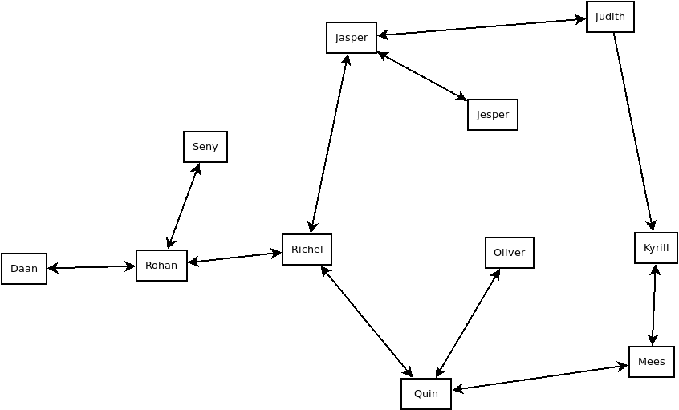
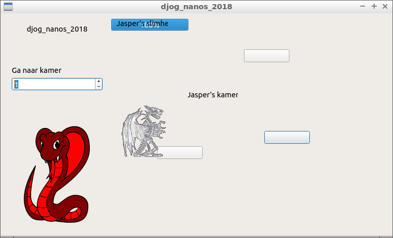
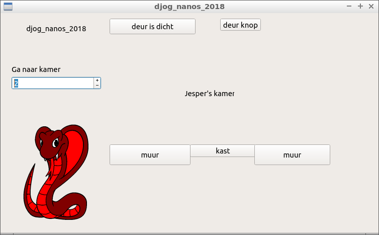
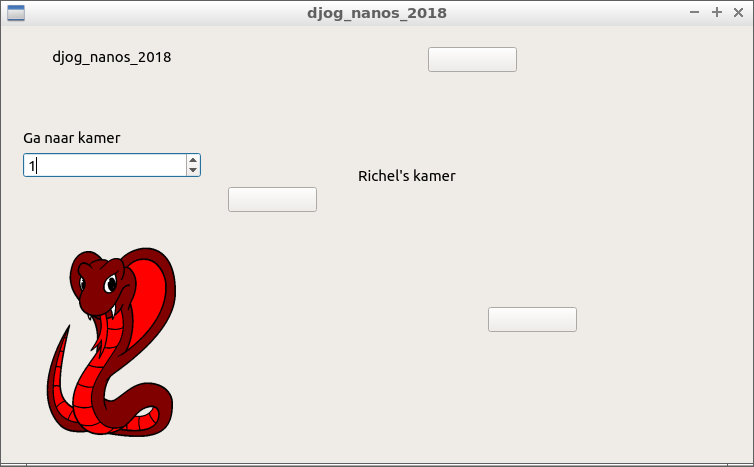

# djog_nanos_2018

Gezamelijk project van de jongere/bijna-tieners 
op de donderdagavond van de [Dojo](https://github.com/richelbilderbeek/Dojo) in schooljaar 2018-2019.

`git` branches:

Branch|||
---|---|---|---
`master`| | |
`develop`| | |
`daan`| | |
`jasper`| | |
`jesper`| | |
`judith`| | |
`kyrill`| | |
`mees`| | |
`oliver`| | |
`quinn`| | |
`richel`| | |
`rohan`| | |
`seny`| | |

## Doel

Samen een adventure game maken, die zich afspeelt in de toekomst, met
een steampunk thema.

  * [gedrag](doc/gedrag.md)
  * [git](doc/git.md)
  * [planning](doc/planning.md)
  * [team](team/README.md)
  * [video's](doc/videos.md)

## Plaatjes

Plaatjes moeten precies 800 pixels breed en 600 pixels hoog zijn.

## Voortgang

## Links

 * [Dojo](https://github.com/richelbilderbeek/Dojo)
